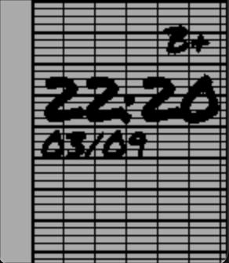

# Let The Children Pebble

A Pebble watchface inspired by **school notebooks** ✏️📓  
Designed for back-to-school season, this watchface shows the time and date as if handwritten in a notebook, with a **left margin**, **Seyes-style grid background**, and the **Permanent Marker** Google Font.

A fun twist: a **grade (A+ to F)** is displayed in the top-right corner, reflecting your Pebble's current battery level 🔋.

---

## 🛠 Features

- Time in large handwritten style (Permanent Marker 40px).
- Date in `dd/mm` format, displayed just below the time.
- Custom background: Seyes-style notebook grid with a left margin.
- Battery level shown as a school grade (A+ … F).
- Optimized for long battery life (updates only once per minute, no animations).

---

## 📸 Screenshot

---

## 📦 Resources

- [Google Fonts – Permanent Marker](https://fonts.google.com/specimen/Permanent+Marker)
- Notebook background generated in monochrome (compatible with Pebble 2 / aplite).

---

## 📄 License

Open-source project (MIT).  
Permanent Marker font © Google Fonts – Apache 2.0 License.
